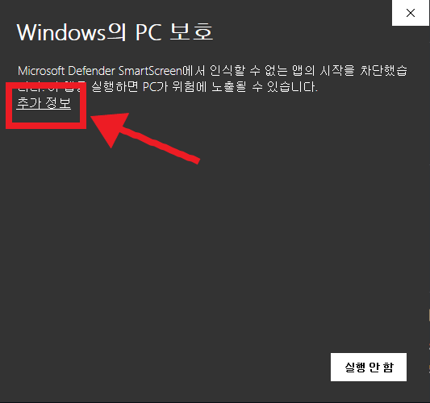
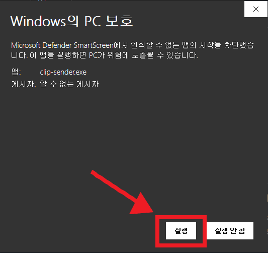
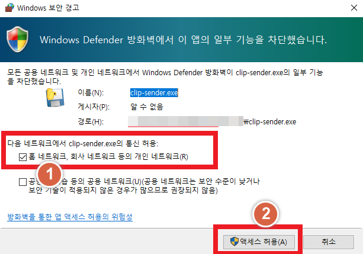

# 클립 전송기

카드뉴스 ZIP 파일을 폴더에 넣으면 자동으로 정리해주고,
폰으로 이미지를 받고 클립에 올릴 글을 복사할 수 있게 해주는 Windows 프로그램이에요.

 

위 파란 버튼을 누르면 최신 버전이 바로 받아져요.

---

## 시작하기

1. 받은 `clip-sender.exe`를 바탕화면이나 문서 안의 **새 폴더**에 넣어요. (다운로드 폴더에 그대로 두지 마세요)
2. `clip-sender.exe`를 **더블클릭**해요. 브라우저에 프로그램 화면이 열려요.
3. 화면의 **"카드뉴스 폴더 열기"**를 눌러 폴더를 열고, 카드뉴스 ZIP 파일을 넣으면 목록에 나타나요.

---

## 처음 실행할 때 나오는 화면

서명하지 않은 프로그램이라 처음에는 Windows가 경고 화면을 보여줘요. 아래 순서대로 누르면 돼요.

| 1단계 | 2단계 | 3단계 |
|:---:|:---:|:---:|
| **추가 정보** 누르기 | **실행** 누르기 | **액세스 허용** 누르기 |
|  |  |  |
| "Windows의 PC 보호"가 나오면 | 앱 정보가 나오면 | 방화벽 알림이 나오면 |

> 3단계 방화벽 알림은 폰으로 볼 때 필요해요. 집이나 사무실 같은 **개인 네트워크**만 체크된 상태로 두고 누르세요.
>
> 받을 때 브라우저가 "위험할 수 있다"고 알려주면, 다운로드 목록의 `...` 메뉴에서 **유지**를 눌러요.

---

## 사용법

프로그램 화면 위쪽 **도움말**에서 볼 수 있어요.

## 의견

프로그램 화면 위쪽 **의견 보내기**로 버그나 개선사항을 남겨주세요.
